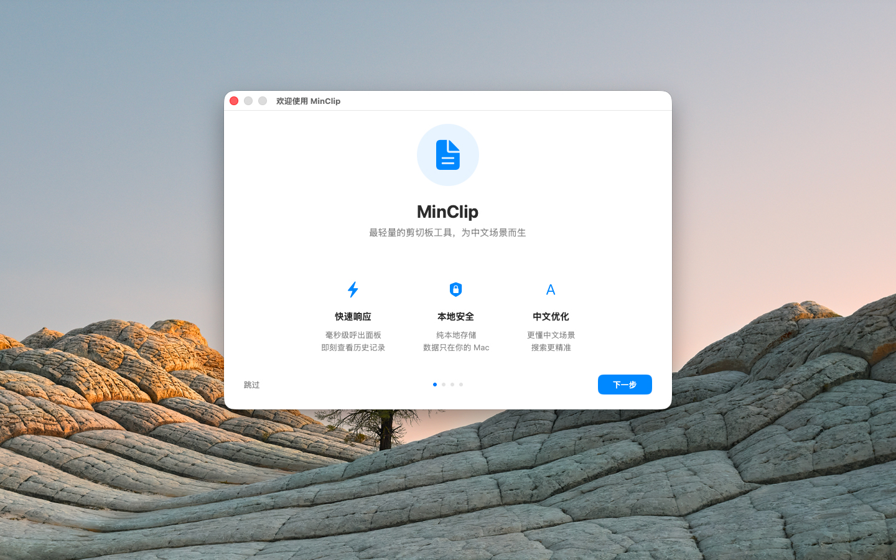
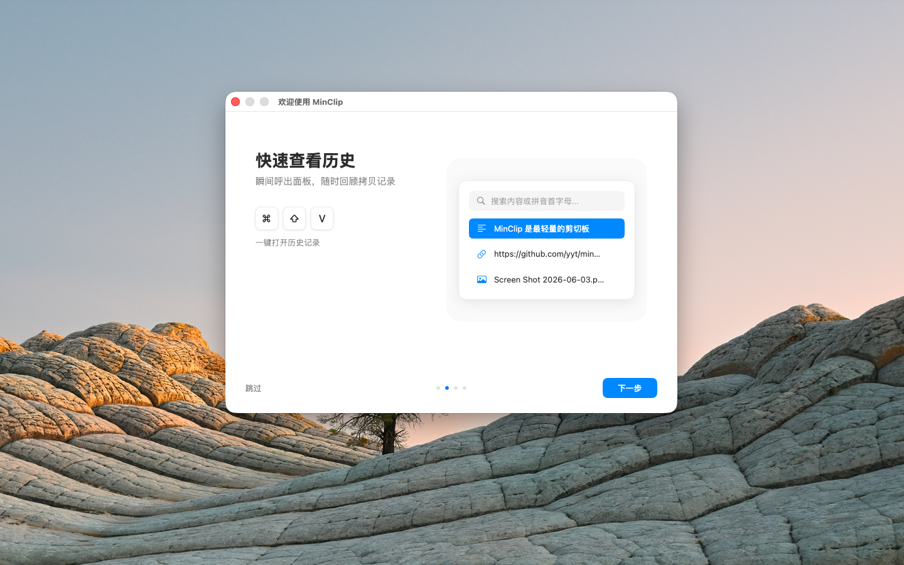
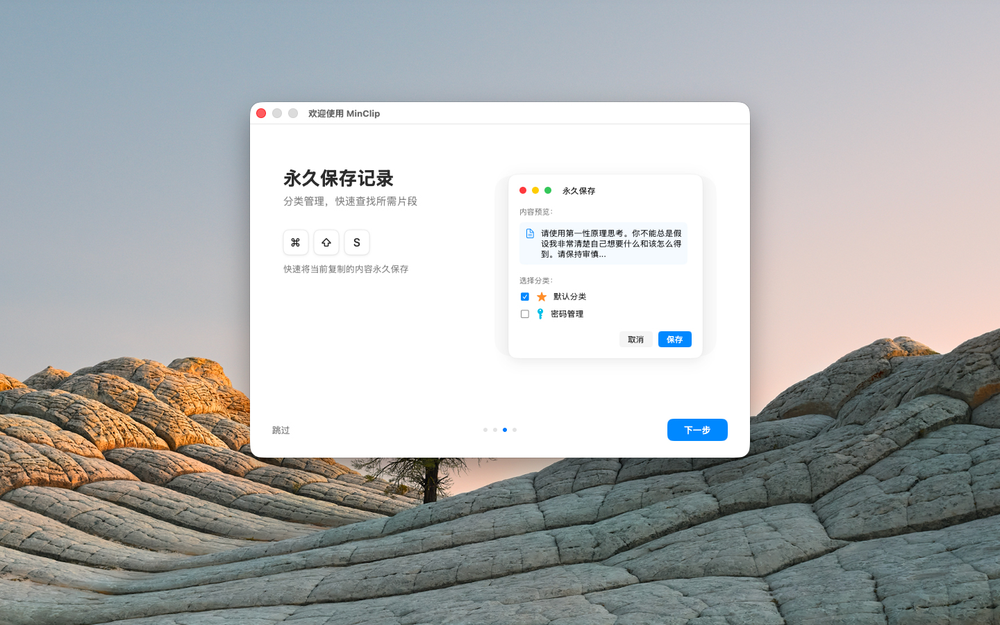

# MinClip

MinClip 是一款面向 macOS 的菜单栏剪贴板管理工具。

它会在后台自动记录你复制过的文本、图片、文件和富文本内容，让常用片段可以随时找回、快速复用，不必在聊天窗口、文档、终端和浏览器之间来回翻找。

当前最新公开版本为 `v1.2.0`，详细更新内容见 [CHANGELOG.md](/Users/yyt/web/yyt/project/minClip/CHANGELOG.md)。

官网与下载：

- 官网：[https://yyt0315.github.io/minClip/](https://yyt0315.github.io/minClip/)
- 下载：[GitHub Releases](https://github.com/yyt0315/minClip/releases/latest)
- 更新记录：[CHANGELOG.md](/Users/yyt/web/yyt/project/minClip/CHANGELOG.md)

## 产品定位

MinClip 适合这几类用户：

- 经常复制代码、命令、文案、链接的开发者和内容工作者
- 希望把常用片段沉淀成长期可复用素材的人
- 想用键盘完成大部分剪贴板操作、减少鼠标切换的人

相比只提供“历史记录”的剪贴板工具，MinClip 更强调三件事：

- **记录**：自动保存复制历史，不漏掉刚刚拷过的内容
- **整理**：把高频内容永久保存、分类管理、置顶展示
- **再处理**：在复制前预览、编辑、转换文本内容

## 核心功能

- **自动记录剪贴板历史**：支持文本、图片、文件、富文本内容
- **菜单栏快速访问**：点击图标或通过全局快捷键立即呼出面板
- **三栏联动工作台**：侧边栏、历史列表、预览区协同工作，浏览和整理更高效
- **永久保存收藏**：将重要内容从“临时历史”升级为“长期素材”
- **置顶显示**：常用收藏固定在列表顶部，减少反复查找
- **分类管理**：支持自定义分类、图标、颜色、拖拽排序
- **独立存储路径**：分类可单独存放，方便备份和归档
- **智能搜索**：支持中文、拼音全拼、拼音首字母、英文首字母匹配
- **右侧预览面板**：更适合查看长文本、图片、文件和富文本内容
- **内置文本加工工具**：支持 JSON 格式化、去除富文本格式、Base64/URL 编解码等操作
- **富文本转 Markdown**：复制网页或文档内容后更容易二次整理和沉淀
- **CSV 导出**：分类内容可导出，便于迁移和整理
- **隐私与稳定性增强**：支持忽略密码管理器等敏感应用内容，并优化数据存储安全性
- **开机自启动**：登录系统后自动可用

## 快捷键

### 全局快捷键

| 快捷键 | 功能                     |
| ------ | ------------------------ |
| `⌘⇧V`  | 打开 / 关闭历史记录面板  |
| `⌘⇧S`  | 将当前剪贴板内容永久保存 |

### 面板内操作

| 快捷键        | 功能                             |
| ------------- | -------------------------------- |
| `↑` `↓`       | 在列表或侧边栏中移动选择         |
| `⌘↑` / `⌘↓`   | 快速跳到顶部或底部               |
| `←` `→`       | 在侧边栏与列表之间切换           |
| `↵`           | 复制当前选中内容                 |
| `Tab`         | 聚焦搜索框                       |
| `Esc`         | 清空搜索；连续按两次可关闭面板   |
| `⌘0`          | 切换到历史记录                   |
| `⌘1` - `⌘4`   | 快速切换分类                     |
| `Space`       | 打开 / 关闭预览面板              |
| `⌘←` / `⌘→`   | 切换预览中的转换工具标签         |
| `⌘⇧1` - `⌘⇧0` | 直接复制列表中的第 1 - 10 条内容 |
| `⌘,`          | 打开设置                         |

## 使用技巧

- **全键盘流**：先用 `⌘⇧V` 呼出面板，再用 `Tab`、方向键和回车即可完成搜索、选择、复制。
- **快速预览**：在列表中按 `Space` 打开预览，适合连续查看长文本、代码片段和图片内容。
- **复制前处理文本**：在预览区里直接做 JSON 格式化、去除富文本格式、URL 解码、Base64 编解码，再按回车复制处理后的结果。
- **用拼音找中文内容**：例如输入 `pg` 或 `pingguo` 都能匹配“苹果”。
- **把高频内容保存到分类**：命令、提示词、固定回复、邮箱模板都适合长期保存。
- **对重要收藏置顶**：常用片段固定在最上方，避免被新内容淹没。
- **按主题分分类**：比如“代码片段”“文案模板”“账号信息”“临时素材”，后续会更好找。
- **分类单独存储**：对重要资料单独设置存储位置，备份和同步更轻松。
- **查看版本变化**：每次升级后可以直接看 [CHANGELOG.md](/Users/yyt/web/yyt/project/minClip/CHANGELOG.md) 了解新功能和优化。

## 典型使用场景

- 保存常用终端命令、SQL、Git 操作片段
- 整理客服回复、销售话术、邮件模板
- 临时复制网页内容后转成更干净的文本或 Markdown
- 管理设计素材链接、文件路径、截图与说明文字
- 把高频使用的代码注释、Prompt、提交信息模板长期沉淀下来

## 界面预览

